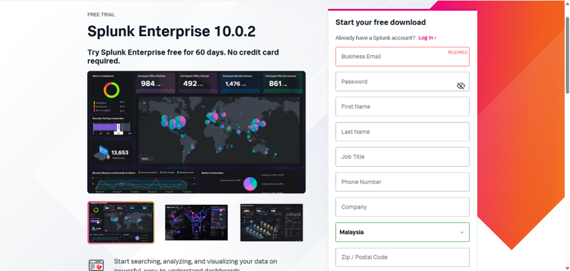

# Coursework-2-BOTSv3-Incident-Analysis-and-Presentation

# INTRODUCTION

A Security Operations Center (SOC) is a central unit responsible for continuously monitoring, analyzing, and improving an organization’s cybersecurity posture. Its main purpose is to prevent, detect, investigate, and respond to threats by transforming raw log data into actionable intelligence. SOC operations rely on specialized roles, structured processes, and technical tools such as Security Information and Event Management (SIEM) systems, intrusion detection platforms, and threat intelligence feeds to maintain situational awareness and manage security incidents effectively. This investigation mimics the lifecycle of an incident, progressing from initial cloud-based anomalies to granular host-level forensic analysis.
  
The Boss of the SOC (BOTSv3) dataset, created by Splunk, simulates a realistic security environment for training purposes. It focuses on a fictional brewing company, Frothly, and includes logs from network, endpoint, email, and cloud services such as AWS and Microsoft Azure. The dataset allows users to practice detecting anomalies, investigating incidents, and responding to threats using Splunk’s Search Processing Language (SPL).

### OBJECTIVES:
•	Identify legitimate IAM users accessing AWS services.  
•	Detect API activity performed without Multi-Factor Authentication (MFA).  
•	Analyze S3 bucket misconfigurations and identify responsible IAM users. 
•	Determine the names of publicly accessible buckets and uploaded files. 
•	Establish an asset inventory baseline to identify hardware configurations and detect OS version discrepancies (drift) 

### SCOPE AND ASSUMPTIONS:
•	Focus on AWS cloud infrastructure and internal endpoints.  
•	Logs are assumed accurate and reflective of SOC monitoring scenarios. 
•	Analysis is limited to the BOTSv3 dataset; no real-world systems are affected. 
•	Investigation demonstrates detection, analysis, and SOC-relevant response techniques. 

 

# SOC ROLES & INCIDENT HANDLING REFLECTION

During the BOTSv3 exercise, the structure and responsibilities of a Security Operations Center (SOC) were highly relevant, simulating real-world cybersecurity monitoring, detection, and response. SOC operations are typically divided into multiple tiers. Tier 1, the alert analyst, focused on initial identification and validation of suspicious activity, such as AWS CloudTrail alerts, demonstrating the importance of rapid detection and escalation. Tier 2, the incident responder, conducted deeper investigation, analyzed attack patterns, correlated logs, and determined the scope of incidents, reflecting escalation from cloud alerts to host-level forensic analysis. Tier 3, including threat hunters and SOC engineers, managed complex incidents, performed detailed forensic analysis, and implemented long-term mitigations. This progression mirrors the “pivot” in professional SOCs, where alerts move from high-level monitoring to granular endpoint examination.
  
The exercise also highlighted the structured incident lifecycle consistent with frameworks like PIER (Preparation, Identification, Containment, Eradication, Recovery) and NIST SP 800-61. Preventive measures, such as secure configurations and access controls, reduced the risk of successful attacks. Detection relied on monitoring tools and alerts, while response involved containment and mitigation actions. Recovery included restoring normal operations and incorporating post-incident activity, such as identifying processor types or OS versions to update asset baselines and enhance future detection rules. Overall, BOTSv3 reinforced the criticality of clear tiered responsibilities, coordinated incident handling, and continuous improvement, demonstrating how SOCs maintain organizational cybersecurity resilience and adapt their detection strategies based on lessons learned.

# INSTALLATION & DATA PREPARATION

Splunk Enterprise was installed using the official Splunk website to ensure software authenticity and security. An account was first created on the Splunk platform to enable access to licensed downloads. Then, Splunk Enterprise was downloaded and installed on a Windows-based system to simulate a SOC analyst workstation environment. During installation, an administrator account was configured to support secure access and accountability, which aligns with SOC operational practices. Successful installation was verified by accessing the Splunk web interface and confirming that the Splunk service was running correctly.

  
   
  <strong>Figure 1:</strong> Splunk Platform Registration

   
   
  <strong>Figure 2:</strong> Splunk Enterprise Installation Package

   
   
  <strong>Figure 3:</strong> Splunk Web Interface

 
Additionally, the Splunk Universal Forwarder was downloaded and installed as a core SOC data collection component, allowing logs from endpoint and server systems to be securely forwarded to the central SIEM platform. 

   
   
  <strong>Figure 4:</strong> Splunk Universal Forwarder Downloader

After downloading the BOTSv3 dataset from the official Splunk GitHub repository (https://github.com/splunk/botsv3), the data was extracted and placed into the Splunk apps directory at (C:\Program Files\Splunk\etc\apps). Following extraction, the Splunk Enterprise service was restarted via the Server Controls panel. Dataset validation was then performed by executing test searches using “index=botsv3” to confirm that the data was successfully ingested. 

   
   
  <strong>Figure 5:</strong> Download Dataset from GitHub Repository

   
   
  <strong>Figure 6:</strong> Extract Data Into C Drive

   
   
  <strong>Figure 7:</strong> Restart Splunk via Server Control Panel

   
   
  <strong>Figure 8:</strong> Dataset Validation

### JUSTIFICATION OF SETUP CHOICES
1.	Splunk Enterprise Installation:
Installing Splunk Enterprise on a Windows-based system provides a stable and supported environment for a SOC analyst workstation. Splunk is widely used in industry SOCs for centralising and correlating security logs, making it ideal for monitoring, detecting, and investigating incidents. Using the official Splunk website ensures software authenticity and mitigates the risk of compromised or malicious software entering the SOC environment.
2.	Administrator Account Configuration:
Creating and configuring an administrator account enforces access control and accountability, which are critical in a SOC. Only authorised personnel can modify configurations, create indexes, or ingest data, preventing unauthorised changes that could compromise security monitoring and incident analysis.
3.	Universal Forwarder Installation:
The Universal Forwarder was installed to simulate real-world SOC architecture, where logs are collected from distributed endpoints and servers and securely forwarded to a central SIEM platform. This ensures all relevant data is aggregated for monitoring and correlation, reflecting standard SOC operations.
4.	Dataset Placement and Ingestion:
Extracting the BOTSv3 dataset into the Splunk apps directory allows Splunk to automatically recognise it as an app, enabling indexing, source type assignment, and access to pre-configured dashboards. This mirrors SOC practices where structured, centralised log data is necessary for timely threat detection and investigation.
5.	Service Restart and Validation:
Restarting Splunk after dataset placement ensures the platform fully recognises the app and ingested logs. Validation through test searches confirms that data is correctly indexed, timestamps are accurate, and fields are available for correlation. This step reflects SOC best practices, where verified and reliable data is essential for operational readiness and accurate incident response.

# GUIDED QUESTION

### Q1- IAM USERS ACCESSING AWS SERVICES
<b> ANSWER: </b> bstoll,btun,splunk_access,web_admin

<b> QUERY: </b>    

   
   

<b> QUERY EXPLANATION: </b>  
• stats values(userIdentity.userName) AS user: Aggregates unique IAM usernames, eliminating duplicates.  
•	eval user=mvsort(user): Sorts usernames alphabetically. 
•	eval user=mvjoin(user,","): produces a single comma-separated string.  
<b> ANALYSIS: </b> 
Identifies all IAM users who accessed AWS services in Frothly’s environment, giving SOC analysts visibility to verify authorized activity and detect unusual access. This supports accountability, compliance, and early detection of potential security incidents.  
<b> SOC RELEVANCE: </b>    
•	SOC analysts can create activity baselines for each IAM user to detect unusual patterns that may indicate compromised credentials. 
•	Unusual authentication or access attempts can highlight insider threats, brute-force attacks, or other malicious activities. 
•	Maintaining a reliable record of IAM activity supports regulatory compliance and internal audits. 
•	During Tier-1 triage, analysts verify whether IAM activity is normal, while Tier-2 analysis connects identity logs with other alerts to identify potential threats. 
•	Regular monitoring helps enforce least-privilege policies and ensures timely detection of anomalies before they escalate into security incidents. 

   
   
  <strong>Figure 9:</strong> IAM Users Accessing Aws Services

### Q2- IDENTIFYING AWS API ACTIVITY WITHOUT MFA
<b> ANSWER: </b>userIdentity.sessionContext.attributes.mfaAuthenticated

<b> QUERY: </b>    

   
   

<b> QUERY EXPLANATION: </b>  
•	search additionalEventData.MFAUsed=* ORuserIdentity.sessionContext.attributes.mfaAuthenticated=*: Identifies events containing MFA usage information  
•	userIdentity.sessionContext.attributes.mfaAuthenticated: Primary JSON field to alert on for API activity without MFA  
•	search NOT eventName="ConsoleLogin": Excludes console logins  
•	stats values(...) BY eventType:  Aggregates MFA usage by API event type   
<b> ANALYSIS: </b> 
Monitoring API activity without MFA is critical for SOC operations. MFA adds an extra layer of authentication, and missing MFA can indicate misconfigurations or potential account compromise.  
<b> SOC RELEVANCE: </b>    
•	SOC analysts can monitor API activity to ensure all users are enforcing MFA.
•	Detection of missing MFA helps identify potential account takeovers or unauthorized access attempts. 
•	Analysts can investigate privilege escalation attempts where users try to gain higher privileges than authorized. 
•	During Tier-1 triage, SOC verifies whether API activity is normal, while Tier-2 analysis correlates MFA logs with other alerts to spot threats. 
•	Regular monitoring supports proactive prevention and ensures timely response to potential security incidents.  

   
   
  <strong>Figure 10:</strong> Aws Api Activity Without MFA

### Q3- PROCESSOR NUMBER USED ON THE WEB SERVERS
<b> ANSWER: </b>E5-2676

<b> QUERY: </b>    

   
   

<b> QUERY EXPLANATION: </b>  
•	sourcetype=hardware:  Retrieves host-level hardware information including processor-related   
<b> ANALYSIS: </b> 
Returns hardware information for hosts within Frothly’s environment, including processor-related data. By reviewing the returned fields, SOC analysts can identify the processor numbers used on systems, including web servers, to understand their hardware configuration.  
<b> SOC RELEVANCE: </b>    
•	During Tier-1 triage, SOC verifies whether web server hardware matches expected baselines. 
•	During Tier-2 analysis, SOC correlates processor information with other alerts to investigate potential anomalies or vulnerabilities. 
•	Regular monitoring helps maintain asset visibility and supports effective incident response. 
•	Provides context for investigations involving critical infrastructure, enabling SOC teams to prioritise actions based on the importance of the affected hosts.  

   
   
  <strong>Figure 11:</strong> Processor Number

### Q4 - EVENT ID OF PUBLIC S3 BUCKET MISCONFIGURATION
<b> ANSWER: </b>ab45689d-69cd-41e7-8705-5350402cf7ac

<b> QUERY Q4-Q6: </b>    

   
   

<b> QUERY EXPLANATION: </b>  
•	eventName="PutBucketAcl":  Filters logs to S3 bucket ACL modification events. 
•	sort _time: Orders the events from earliest to latest. 
•	head 1: Returns the earliest bucket ACL change.  
<b> ANALYSIS: </b> 
Identifies the earliest occurrence of an S3 bucket ACL modification in Frothly’s AWS environment. The PutBucketAcl action is commonly associated with changes that can expose S3 buckets to public access. Identifying the first instance helps establish the starting point of the misconfiguration.  
<b> SOC RELEVANCE: </b>    
•	SOC analysts can identify changes to S3 bucket permissions that may expose data publicly 
•	Supports early detection of misconfigurations that could lead to data leakage or unauthorized access 
•	Assists Tier-1 triage in triaging alerts related to risky cloud storage activities 
•	Allows Tier-2 analyst to correlate bucket permission changes with user identity and source IP for deeper investigation 
•	Helps enforce cloud security best practices and compliance requirements by monitoring sensitive configuration changes  

   
   
  <strong>Figure 12:</strong>Event ID

### Q5- BUD’S USERNAME
<b> ANSWER: </b>stoll  
<b> ANALYSIS: </b> 
IAM user bstoll was identified as the account responsible for the S3 bucket ACL modification. This establishes accountability and pinpoints the source of the misconfiguration.   
<b> SOC RELEVANCE: </b>    
•	Pinpoints the exact user responsible for a high-risk cloud activity, enabling targeted investigation 
•	Supports Tier-1 triage by verifying whether the IAM user’s activity aligns with expected permissions 
•	Allows Tier-2 analysis to correlate user actions with other suspicious events for incident response 
•	Strengthens accountability and auditing by linking cloud misconfigurations to specific identities 
•	Facilitates enforcement of least-privilege policies and mitigation of potential data leaks  

   
   
  <strong>Figure 13:</strong>Bud's Username

### Q6- NAME OF THE S3 BUCKET
<b> ANSWER: </b>frothlywebcode  
<b> ANALYSIS: </b> 
S3 bucket frothlywebcode was identified as publicly accessible due to a misconfiguration made via the PutBucketAcl API call.   
<b> SOC RELEVANCE: </b>    
•	Enables SOC analysts to pinpoint cloud resources at risk and take prompt action to secure them 
•	Supports Tier-1 triage by confirming whether public access was authorized or anomalous 
•	Facilitates Tier-2 investigation by correlating the bucket exposure with other alerts and user activity 
•	Strengthens auditing and compliance by documenting which resources were misconfigured and by whom 
•	Helps enforce cloud security policies and minimize potential data exfiltration risk  

   
   
  <strong>Figure 14:</strong> S3 Bucket Name

### Q7- UPLOADED TEXT FILE
<b> ANSWER: </b>OPEN_BUCKET_PLEASE_FIX.txt

<b> QUERY: </b>    

   
   

<b> QUERY EXPLANATION: </b>  
•	txt frothlywebcode: Filters logs containing the keywords txt and frothlywebcode 
•	| sort _time: Sorts the results from the earliest to latest events  
<b> ANALYSIS: </b> 
Identifies the text file that was successfully uploaded to the frothlywebcode S3 bucket while it was publicly accessible. Sorting by time helps trace the sequence of events, confirming which file was staged for potential data exfiltration.  
<b> SOC RELEVANCE: </b>    
•	Locating uploaded files in publicly accessible buckets helps detect potential data exfiltration. 
•	SOC analysts can investigate whether the upload was authorized or malicious. 
•	Early identification of exposed data supports incident containment and remediation. 
•	Monitoring such activity aligns with SOC responsibilities for detection, prevention, and rapid response.  

   
   
  <strong>Figure 15:</strong> Upload Text File

### Q8- Unique Windows Endpoint
<b> ANSWER: </b>BSTOLL-L.froth.ly

<b> QUERY: </b>    

   
   

<b> QUERY EXPLANATION: </b>  
•	sourcetype=WinEventLog:Security: Filters logs to Windows Security Event Logs 
•	rex field=_raw "Account Name:\s+(?<AccountName>[^\r\n]+)": Extracts the account names from the raw event data 
•	stats values(AccountName) AS AccountName BY host, ComputerName: Aggregates unique account names for each host and ComputerName  
<b> ANALYSIS: </b> 
Identifies all user accounts that have interacted with each Windows endpoint in the environment. By aggregating account names by host and ComputerName, it becomes apparent which endpoints have unusual or additional accounts. In this dataset, BSTOLL-L.froth.ly stands out as it contains multiple unusual accounts.  
<b> SOC RELEVANCE: </b>    
•	Monitoring account activity per endpoint allows SOC analysts to detect deviations from normal account patterns. 
•	Detects potential misconfigurations, unauthorized accounts, or anomalies in endpoint setups. 
•	Supports incident triage by highlighting endpoints that may require further investigation due to abnormal user activity. 
•	Helps enforce least-privilege access policies and ensures proper visibility for detection and response. 
•	Aggregating account information aids in compliance and auditing by providing a clear record of user access per host. 
  

   
    
    
   
  <strong>Figure 16:</strong> Windows Endpoint

# CONCLUSION

The investigation of Frothly’s hybrid cloud and endpoint infrastructure through the BOTSv3 dataset highlights the importance of a telemetry-driven, structured SOC approach. Across Questions 1–8, a comprehensive analysis was conducted: monitoring IAM users and API activity to detect non-MFA access, identifying the event ID and responsible IAM user for public S3 bucket misconfigurations, determining the names of exposed buckets and files, retrieving processor numbers for web servers, and identifying endpoints running differing OS editions. These activities demonstrate the value of correlating cloud-level events with host-level telemetry, such as hardware and OS profiles, for full visibility into potential security risks.  
  
### KEY FINDINGS: 
•	Detecting API activity without MFA revealed critical gaps in identity security, allowing SOC analysts to identify potential account compromises. 
•	Publicly accessible S3 buckets were traced to specific IAM users, emphasizing misconfigurations as a major vector for data exposure. 
• Host-level analysis of processors and OS editions established asset baselines, enabling detection of anomalous hardware or software configurations. 

### SOC STRATEGY IMPLICATIONS:
•	Correlating cloud and host logs improve detection efficiency and reduces the mean time to detect (MTTD).  
•	Continuous monitoring of hardware and operating system configurations ensures prompt identification of deviations or unauthorized changes. 
•	Enforcing MFA and secure S3 configurations reduces attack surfaces and prevents misconfigurations. 

Overall, the exercise demonstrates that a SOC’s effectiveness depends on integrating continuous monitoring, structured tiered analysis, and feedback loops, where Tier-3 forensic insights inform Tier-1 triage rules to strengthen detection, response, and proactive prevention.

